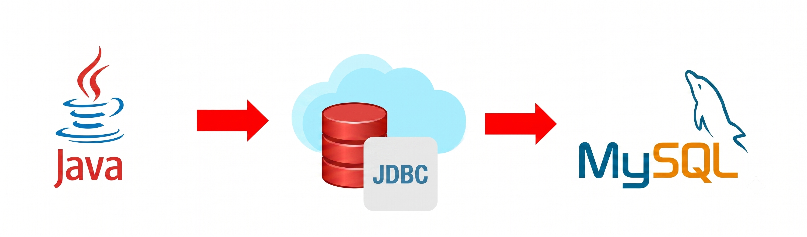

# 🗄️ Task 2 – Java MySQL CRUD Operations (JDBC)


## 🎯 Objective
Create a Java application that connects to a MySQL database using **JDBC** and performs basic **CRUD operations**:
- Insert Data
- Fetch/Retrieve Data
- Update Data
- Delete Data

This completes the requirement of database connectivity and data retrieval, with additional functionality included.

---

## 🛠️ Technologies Used
- Java (JDK 8+)
- JDBC (MySQL Connector/J)
- MySQL Database
- VS Code / IntelliJ / Eclipse
- MySQL Workbench / phpMyAdmin

---

## 📂 Project Files

| File Name | Purpose |
|-----------|---------|
| `InsertDemo.java` | Insert new record into table |
| `FetchData.java` | Retrieve and display data |
| `Update.java` | Update existing record |
| `Delete.java` | Delete record from table |
| `README.md` | Documentation file |

---

## 🗃️ Database Table (Example Data)

| name  | email           | password | gender |
|-------|----------------|----------|--------|
| Rajib | Rajib@gmail.com | 12580    | male   |
| Sonu  | Sonu@gmail.com  | 25463    | male   |
| Niki  | Niki@gmail.com  | 14314    | female |

Database Name: `task_db`  
Table Name: `users`

---

## ▶️ How to Run

1. Add MySQL Connector JAR to your project  
2. Update database credentials in each `.java` file  
3. Run files individually from IDE or terminal

Example run (VS Code / IntelliJ):

```bash
javac FetchData.java
java FetchData


